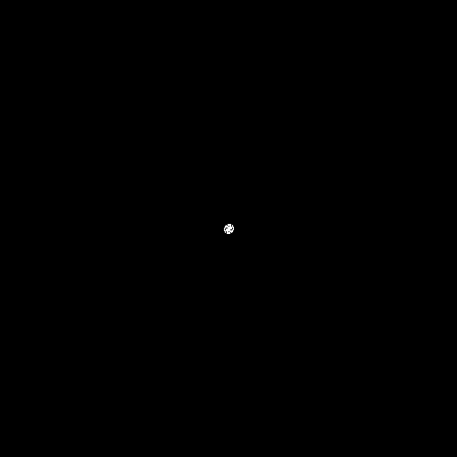

# g3n3r4t1v3
4 c0ll3ct10n 0f g3n3r4t1v3 4rt m4d3 by m3 1n pr0c3ss1ng.
D0 wh4t3v3r y0u w4nt w1th 1t.

## /black_hole

https://www.openprocessing.org/sketch/397158

## /galaxy

https://www.openprocessing.org/sketch/209547

## /grids

https://www.openprocessing.org/sketch/210032

## /patterns

https://www.openprocessing.org/sketch/377406

## /roots

https://www.openprocessing.org/sketch/436309

## /swarm

https://www.openprocessing.org/sketch/214311

## /worm

https://www.openprocessing.org/sketch/209914

## /r00t

